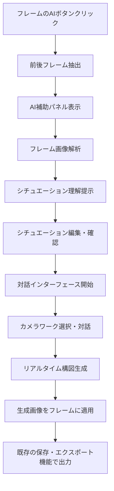

# 絵コンテAI補助機能 統合設計書 (改訂版)

## 1. 概要

既存のStoryboardViewerアプリケーションに、AI補助による中間フレーム構図提案機能を統合する。ユーザーは任意のフレームでAI補助機能を呼び出し、前後のフレームを参照しながら対話的に構図を調整できる。

## 2. 既存アプリ構造分析

### 2.1 現在のデータ構造
```typescript
interface Page {
  images: (string | null)[];     // base64 画像データ配列（5個）
  faceTexts: string[];          // 内容テキスト配列（5個）
  dialogueTexts: string[];      // セリフテキスト配列（5個）
  timeValues: string[];         // 時間値配列（5個）
  blendFiles: string[];         // Blendファイルパス配列（5個）
}

interface StoryboardData {
  pages: Page[];
  storyboardName: string;
}
```

### 2.2 既存のフレーム管理
- 各ページに5フレーム固定
- フラットなカット配列：`pageIdx * 5 + cutIdx`
- 画像は512x256にリサイズされてbase64保存
- ドラッグ&ドロップによるフレーム並び替え対応

## 3. 統合アーキテクチャ

### 3.1 コンポーネント構成

```
StoryboardViewer (既存)
├── フレーム表示部分 (既存)
│   ├── AI補助ボタン (新規追加)
│   └── フレーム画像・操作 (既存)
├── StoryboardAIPanel (新規)
│   ├── FrameContext
│   ├── SituationAnalysis (新規)
│   ├── DialogueInterface  
│   ├── CameraWorkPresets
│   └── ImageGenerationArea
└── AIServiceManager (新規)
    ├── ConfigurableAPIs
    └── ImageExtractor
```

### 3.2 データフロー



## 4. 技術仕様

### 4.1 フレーム画像抽出機能

#### 4.1.1 画像抽出ロジック
```typescript
interface FrameExtractor {
  extractContextFrames(
    pages: Page[],
    currentPageIdx: number,
    currentCutIdx: number
  ): {
    previousFrame: string | null;
    currentFrame: string | null;
    nextFrame: string | null;
    fallbackFrames: string[];
    frameNumbers: number[];
  };
}

const extractContextFrames = (
  pages: Page[],
  currentPageIdx: number,
  currentCutIdx: number
): FrameExtractor => {
  const currentGlobalIdx = currentPageIdx * 5 + currentCutIdx;
  const flatImages = pages.flatMap(page => page.images);
  
  const previousFrame = currentGlobalIdx > 0 
    ? flatImages[currentGlobalIdx - 1] 
    : null;
    
  const currentFrame = flatImages[currentGlobalIdx];
  
  const nextFrame = currentGlobalIdx < flatImages.length - 1 
    ? flatImages[currentGlobalIdx + 1] 
    : null;
  
  // 前後にフレームがない場合の代替（1-2個前後）
  const fallbackFrames = [];
  if (!previousFrame && currentGlobalIdx >= 2) {
    fallbackFrames.push(flatImages[currentGlobalIdx - 2]);
  }
  if (!nextFrame && currentGlobalIdx <= flatImages.length - 3) {
    fallbackFrames.push(flatImages[currentGlobalIdx + 2]);
  }
  
  return {
    previousFrame,
    currentFrame,
    nextFrame,
    fallbackFrames,
    frameNumbers: [currentGlobalIdx, currentGlobalIdx + 1, currentGlobalIdx + 2]
  };
};
```

### 4.2 新規追加コンポーネント

#### 4.2.1 AIAssistButton (フレーム内に追加)
```typescript
const AIAssistButton: React.FC<{
  pageIdx: number;
  cutIdx: number;
  onAIAssist: (pageIdx: number, cutIdx: number) => void;
}> = ({ pageIdx, cutIdx, onAIAssist }) => {
  return (
    <button
      onClick={(e) => {
        e.stopPropagation();
        onAIAssist(pageIdx, cutIdx);
      }}
      style={{
        position: 'absolute',
        top: '4px',
        left: '4px',
        width: '24px',
        height: '24px',
        background: '#8b5cf6',
        color: 'white',
        border: 'none',
        borderRadius: '4px',
        fontSize: '12px',
        cursor: 'pointer',
        zIndex: 20,
        display: 'flex',
        alignItems: 'center',
        justifyContent: 'center'
      }}
      title="AI補助で構図生成"
    >
      🤖
    </button>
  );
};
```

#### 4.2.3 SituationAnalysisEditor
```typescript
interface SituationAnalysisData {
  scenario: string;          // シチュエーション
  characters: string;        // 登場人物
  setting: string;          // 場所・環境
  mood: string;             // 雰囲気・感情
  narrative: string;        // ストーリー展開
  objectives: string;       // 中間フレームで表現すべき要素
}

const SituationAnalysisEditor: React.FC<{
  analysis: SituationAnalysisData;
  onUpdate: (analysis: SituationAnalysisData) => void;
  onConfirm: () => void;
  isLoading: boolean;
}> = ({ analysis, onUpdate, onConfirm, isLoading }) => {
  return (
    <div style={{
      padding: '16px',
      background: '#f8fafc',
      border: '1px solid #e2e8f0',
      borderRadius: '8px',
      marginBottom: '16px'
    }}>
      <h4 style={{ 
        fontSize: '16px', 
        fontWeight: '600', 
        marginBottom: '12px',
        color: '#1e293b'
      }}>
        📝 シチュエーション理解
      </h4>
      
      <div style={{ display: 'grid', gap: '12px' }}>
        <div>
          <label style={{ fontSize: '12px', color: '#64748b', fontWeight: '500' }}>
            シチュエーション（場面・状況）
          </label>
          <textarea
            value={analysis.scenario}
            onChange={(e) => onUpdate({ ...analysis, scenario: e.target.value })}
            style={{
              width: '100%',
              minHeight: '60px',
              padding: '8px',
              border: '1px solid #d1d5db',
              borderRadius: '4px',
              fontSize: '13px',
              resize: 'vertical'
            }}
            placeholder="例: キャラクターAとBが重要な会話をしている緊張した場面"
          />
        </div>
        
        <div style={{ display: 'grid', gridTemplateColumns: '1fr 1fr', gap: '12px' }}>
          <div>
            <label style={{ fontSize: '12px', color: '#64748b', fontWeight: '500' }}>
              登場人物
            </label>
            <input
              value={analysis.characters}
              onChange={(e) => onUpdate({ ...analysis, characters: e.target.value })}
              style={{
                width: '100%',
                padding: '6px 8px',
                border: '1px solid #d1d5db',
                borderRadius: '4px',
                fontSize: '13px'
              }}
              placeholder="例: 主人公、ヒロイン"
            />
          </div>
          
          <div>
            <label style={{ fontSize: '12px', color: '#64748b', fontWeight: '500' }}>
              場所・環境
            </label>
            <input
              value={analysis.setting}
              onChange={(e) => onUpdate({ ...analysis, setting: e.target.value })}
              style={{
                width: '100%',
                padding: '6px 8px',
                border: '1px solid #d1d5db',
                borderRadius: '4px',
                fontSize: '13px'
              }}
              placeholder="例: 学校の屋上、夕暮れ"
            />
          </div>
        </div>
        
        <div>
          <label style={{ fontSize: '12px', color: '#64748b', fontWeight: '500' }}>
            雰囲気・感情
          </label>
          <input
            value={analysis.mood}
            onChange={(e) => onUpdate({ ...analysis, mood: e.target.value })}
            style={{
              width: '100%',
              padding: '6px 8px',
              border: '1px solid #d1d5db',
              borderRadius: '4px',
              fontSize: '13px'
            }}
            placeholder="例: 緊張感、期待感、不安"
          />
        </div>
        
        <div>
          <label style={{ fontSize: '12px', color: '#64748b', fontWeight: '500' }}>
            ストーリー展開
          </label>
          <textarea
            value={analysis.narrative}
            onChange={(e) => onUpdate({ ...analysis, narrative: e.target.value })}
            style={{
              width: '100%',
              minHeight: '50px',
              padding: '8px',
              border: '1px solid #d1d5db',
              borderRadius: '4px',
              fontSize: '13px',
              resize: 'vertical'
            }}
            placeholder="例: AがBに告白しようとしているが、まだ言い出せずにいる"
          />
        </div>
        
        <div>
          <label style={{ fontSize: '12px', color: '#64748b', fontWeight: '500' }}>
            中間フレームで表現すべき要素
          </label>
          <textarea
            value={analysis.objectives}
            onChange={(e) => onUpdate({ ...analysis, objectives: e.target.value })}
            style={{
              width: '100%',
              minHeight: '60px',
              padding: '8px',
              border: '1px solid #d1d5db',
              borderRadius: '4px',
              fontSize: '13px',
              resize: 'vertical'
            }}
            placeholder="例: キャラクターの心理的な変化、視線の動き、距離感の変化"
          />
        </div>
      </div>
      
      <div style={{ 
        display: 'flex', 
        justifyContent: 'flex-end', 
        gap: '8px',
        marginTop: '16px'
      }}>
        <button
          onClick={onConfirm}
          disabled={isLoading}
          style={{
            padding: '8px 16px',
            background: '#3b82f6',
            color: 'white',
            border: 'none',
            borderRadius: '4px',
            fontSize: '13px',
            cursor: isLoading ? 'not-allowed' : 'pointer',
            opacity: isLoading ? 0.6 : 1
          }}
        >
          {isLoading ? '解析中...' : 'この内容で対話を開始'}
        </button>
      </div>
    </div>
  );
};
```
```typescript
interface StoryboardAIPanelProps {
  isVisible: boolean;
  selectedFrame: { pageIdx: number; cutIdx: number } | null;
  pages: Page[];
  onClose: () => void;
  onFrameGenerated: (pageIdx: number, cutIdx: number, imageData: string) => void;
  onFrameUpdated: (pageIdx: number, cutIdx: number, updates: Partial<FrameData>) => void;
}

interface StoryboardAIPanelProps {
  isVisible: boolean;
  selectedFrame: { pageIdx: number; cutIdx: number } | null;
  pages: Page[];
  onClose: () => void;
  onFrameGenerated: (pageIdx: number, cutIdx: number, imageData: string) => void;
  onFrameUpdated: (pageIdx: number, cutIdx: number, updates: Partial<FrameData>) => void;
}

const StoryboardAIPanel: React.FC<StoryboardAIPanelProps> = ({
  isVisible,
  selectedFrame,
  pages,
  onClose,
  onFrameGenerated,
  onFrameUpdated
}) => {
  const [currentStep, setCurrentStep] = useState<'analyzing' | 'situation' | 'dialogue'>('analyzing');
  const [situationAnalysis, setSituationAnalysis] = useState<SituationAnalysisData | null>(null);
  
  if (!isVisible || !selectedFrame) return null;
  
  const frameContext = extractContextFrames(pages, selectedFrame.pageIdx, selectedFrame.cutIdx);
  
  return (
    <div style={{
      position: 'fixed',
      top: 0,
      right: 0,
      width: '480px',
      height: '100vh',
      background: 'white',
      boxShadow: '-4px 0 12px rgba(0,0,0,0.15)',
      zIndex: 1000,
      transform: isVisible ? 'translateX(0)' : 'translateX(100%)',
      transition: 'transform 0.3s ease-in-out',
      overflowY: 'auto'
    }}>
      <div style={{ padding: '16px' }}>
        {/* ヘッダー */}
        <div style={{ 
          display: 'flex', 
          justifyContent: 'space-between', 
          alignItems: 'center',
          marginBottom: '16px'
        }}>
          <h3 style={{ fontSize: '18px', fontWeight: '600', margin: 0 }}>
            🤖 AI構図補助
          </h3>
          <button onClick={onClose} style={{
            background: 'none', 
            border: 'none', 
            fontSize: '20px', 
            cursor: 'pointer'
          }}>
            ✕
          </button>
        </div>
        
        {/* ステップインジケーター */}
        <div style={{
          display: 'flex',
          marginBottom: '20px',
          background: '#f1f5f9',
          borderRadius: '8px',
          padding: '4px'
        }}>
          {[
            { key: 'analyzing', label: '解析', icon: '🔍' },
            { key: 'situation', label: 'シチュエーション', icon: '📝' },
            { key: 'dialogue', label: '対話', icon: '💬' }
          ].map((step, index) => (
            <div
              key={step.key}
              style={{
                flex: 1,
                textAlign: 'center',
                padding: '8px 4px',
                borderRadius: '6px',
                fontSize: '12px',
                fontWeight: '500',
                background: currentStep === step.key ? 'white' : 'transparent',
                color: currentStep === step.key ? '#1e293b' : '#64748b',
                boxShadow: currentStep === step.key ? '0 1px 3px rgba(0,0,0,0.1)' : 'none'
              }}
            >
              <div>{step.icon}</div>
              <div>{step.label}</div>
            </div>
          ))}
        </div>
        
        {/* 前後フレーム表示 */}
        <div style={{ marginBottom: '16px' }}>
          <div style={{ display: 'flex', gap: '8px', marginBottom: '8px' }}>
            <div style={{ flex: 1 }}>
              <div style={{ fontSize: '12px', color: '#64748b', marginBottom: '4px' }}>
                前フレーム
              </div>
              {frameContext.previousFrame ? (
                
              ) : (
                <div style={{ 
                  width: '100%', 
                  height: '80px', 
                  background: '#f1f5f9',
                  borderRadius: '4px',
                  display: 'flex',
                  alignItems: 'center',
                  justifyContent: 'center',
                  color: '#64748b',
                  fontSize: '12px'
                }}>
                  フレームなし
                </div>
              )}
            </div>
            
            <div style={{ flex: 1 }}>
              <div style={{ fontSize: '12px', color: '#64748b', marginBottom: '4px' }}>
                次フレーム
              </div>
              {frameContext.nextFrame ? (
                
              ) : (
                <div style={{ 
                  width: '100%', 
                  height: '80px', 
                  background: '#f1f5f9',
                  borderRadius: '4px',
                  display: 'flex',
                  alignItems: 'center',
                  justifyContent: 'center',
                  color: '#64748b',
                  fontSize: '12px'
                }}>
                  フレームなし
                </div>
              )}
            </div>
          </div>
        </div>
        
        {/* ステップ別コンテンツ */}
        {currentStep === 'analyzing' && (
          <div style={{ textAlign: 'center', padding: '32px 0' }}>
            <div style={{ fontSize: '16px', marginBottom: '16px' }}>🔍 フレームを解析中...</div>
            {/* 解析完了後、自動的にsituationステップに遷移 */}
          </div>
        )}
        
        {currentStep === 'situation' && situationAnalysis && (
          <SituationAnalysisEditor
            analysis={situationAnalysis}
            onUpdate={setSituationAnalysis}
            onConfirm={() => setCurrentStep('dialogue')}
            isLoading={false}
          />
        )}
        
        {currentStep === 'dialogue' && (
          <div>
            {/* 既存の対話・カメラワーク・画像生成機能 */}
            <div style={{ marginBottom: '16px', padding: '12px', background: '#f8fafc', borderRadius: '6px' }}>
              <div style={{ fontSize: '12px', color: '#64748b', marginBottom: '4px' }}>
                確認されたシチュエーション:
              </div>
              <div style={{ fontSize: '13px', color: '#374151' }}>
                {situationAnalysis?.scenario}
              </div>
            </div>
            {/* ここに既存のDialogueInterface, CameraPresets, ImageGenerationが入る */}
          </div>
        )}
      </div>
    </div>
  );
};
```

### 4.3 API統合レイヤー

#### 4.3.1 設定可能なAPI管理
```typescript
interface AIConfig {
  dialogue: {
    provider: 'openai' | 'anthropic' | 'custom';
    apiKey: string;
    endpoint?: string;
    model: string;
  };
  imageGeneration: {
    provider: 'replicate' | 'stability' | 'custom';
    apiKey: string;
    endpoint?: string;
    model: string;
  };
}

class AIServiceManager {
  private config: AIConfig;
  
  constructor(config: AIConfig) {
    this.config = config;
  }
  
  async analyzeFrames(frames: {
    previous?: string;
    current?: string;
    next?: string;
  }): Promise<{
    frameAnalysis: {
      previous?: string;
      current?: string;
      next?: string;
    };
    situationAnalysis: {
      scenario: string;          // シチュエーション（場面・状況）
      characters: string;        // 登場人物
      setting: string;          // 場所・環境
      mood: string;             // 雰囲気・感情
      narrative: string;        // ストーリー展開
      objectives: string;       // 中間フレームで表現すべき要素
    };
    suggestions: string[];
  }> {
    // 選択されたAPI providerに応じて分岐
    switch (this.config.dialogue.provider) {
      case 'openai':
        return this.callOpenAIVision(frames);
      case 'anthropic':
        return this.callAnthropicVision(frames);
      default:
        return this.callCustomAPI(frames);
    }
  }
  
  async generateImage(prompt: string, settings: {
    width: number;
    height: number;
    style?: string;
  }): Promise<string> {
    // 画像生成API呼び出し
    // 既存アプリのリサイズ処理を活用してbase64で返す
  }
}
```

## 5. UI/UX設計 (既存アプリに合わせて調整)

### 5.1 推奨レイアウト

```
┌─────────────────────────────────────────────────────────────────────────┐
│ 絵コンテアプリ - 既存ヘッダー・コントロール                                    │
├─────────────────────────────────────────────────────────────────────────┤
│ ┌─────────┐ ┌─────────┐ ┌─────────┐  ┌──────────────────────────────────┐ │
│ │ カット  │ │  画面   │ │  内容   │  │           AI補助パネル             │ │
│ ├─────────┤ ├─────────┤ ├─────────┤  │ 🔍📝💬 [解析→状況→対話]            │ │
│ │ 1       │ │ [🤖]    │ │ 内容1   │  │ ┌──────┐      ┌──────┐          │ │
│ │         │ │ Frame1  │ │ セリフ1 │  │ │前フレ │      │次フレ │          │ │
│ ├─────────┤ ├─────────┤ ├─────────┤  │ │ーム  │      │ーム  │          │ │
│ │ 2       │ │ [🤖]    │ │ 内容2   │  │ └──────┘      └──────┘          │ │
│ │         │ │ Frame2  │ │ セリフ2 │  │                                │ │
│ ├─────────┤ ├─────────┤ ├─────────┤  │ 📝 シチュエーション理解             │ │
│ │ 3       │ │ [🤖]    │ │ 内容3   │  │ ┌────────────────────────────────┐ │ │
│ │ (選択中) │ │ Frame3  │ │ セリフ3 │  │ │シチュエーション: [編集可能]        │ │ │
│ │         │ │ 🔵     │ │         │  │ │登場人物: [編集可能]              │ │ │
│ └─────────┘ └─────────┘ └─────────┘  │ │場所: [編集可能]                 │ │ │
│                        秒            │ │表現すべき要素: [編集可能]        │ │ │
│                                     │ └────────────────────────────────┘ │ │
│                                     │ [この内容で対話を開始]              │ │
│                                     │                                │ │
│                                     │ 💬 対話エリア (状況確認後に表示)    │ │
│                                     │ 📷 カメラワークプリセット           │ │
│                                     │ 🎨 構図生成・プレビュー             │ │
│                                     └──────────────────────────────────┘ │
└─────────────────────────────────────────────────────────────────────────┘
```

### 5.2 既存UIとの統合ポイント

#### 5.2.1 AI補助ボタンの配置
- 各フレームの左上角に小さな🤖ボタンを配置
- 既存の削除ボタン、+ボタン、Blendファイルボタンと干渉しない位置
- `!isExportingPDF`条件で非表示にしてPDF出力に影響なし

#### 5.2.2 サイドパネル表示
- 画面右端からスライドイン形式
- 幅480px（既存の画面幅を圧迫しない）
- 固定表示でスクロールに追従
- 閉じるボタンでパネル非表示

#### 5.2.3 既存状態管理との統合
```typescript
// StoryboardViewer.jsx への追加
const [aiPanelVisible, setAiPanelVisible] = useState(false);
const [selectedAIFrame, setSelectedAIFrame] = useState(null);

const handleAIAssist = (pageIdx, cutIdx) => {
  setSelectedAIFrame({ pageIdx, cutIdx });
  setAiPanelVisible(true);
};

const handleAIFrameGenerated = (pageIdx, cutIdx, imageData) => {
  // 既存のsetPages関数を使用
  setPages(prev => {
    const newPages = [...prev];
    newPages[pageIdx] = {
      ...newPages[pageIdx],
      images: newPages[pageIdx].images.map((img, idx) => 
        idx === cutIdx ? imageData : img
      )
    };
    return newPages;
  });
};
```

## 6. 統合実装手順

### 6.1 Phase 1: 基本統合 (1週間)
- [ ] AIAssistButtonの各フレームへの追加
- [ ] 基本的なサイドパネル表示機能
- [ ] フレーム画像抽出機能
- [ ] AI設定パネルの実装

### 6.2 Phase 2: シチュエーション解析 (1週間)
- [ ] フレーム画像解析API連携
- [ ] SituationAnalysisEditorコンポーネント
- [ ] シチュエーション理解の提示・編集機能
- [ ] 解析結果の保存・復元

### 6.3 Phase 3: AI対話・カメラワーク (1週間)
- [ ] 基本的な対話機能
- [ ] カメラワークプリセット
- [ ] シチュエーション情報を踏まえた対話

### 6.4 Phase 4: 画像生成統合 (1週間)
- [ ] 画像生成API連携
- [ ] 生成画像の既存フレームへの適用
- [ ] プレビュー・再生成機能
- [ ] エラーハンドリング

### 6.5 Phase 5: UX改善・最適化 (1週間)
- [ ] ステップ遷移のアニメーション
- [ ] シチュエーション解析の精度向上
- [ ] 履歴・お気に入り機能
- [ ] パフォーマンス最適化
- [ ] パフォーマンス最適化

## 7. ファイル構成

### 7.1 新規追加ファイル
```
src/
├── components/
│   ├── ai-assistant/
│   │   ├── StoryboardAIPanel.jsx
│   │   ├── AIAssistButton.jsx
│   │   ├── SituationAnalysisEditor.jsx (新規)
│   │   ├── DialogueInterface.jsx
│   │   ├── CameraPresets.jsx
│   │   ├── ImageGenerator.jsx
│   │   └── AIConfigPanel.jsx
│   └── StoryboardViewer.jsx (既存 - 修正)
├── services/
│   ├── ai-service.js
│   ├── frame-extractor.js
│   └── api-providers/
│       ├── openai-provider.js
│       ├── anthropic-provider.js
│       └── replicate-provider.js
├── hooks/
│   ├── useAIService.js
│   └── useFrameExtractor.js
└── utils/
    ├── image-utils.js
    └── ai-prompts.js
```

### 7.2 既存ファイルの修正ポイント

#### StoryboardViewer.jsx
```jsx
// 追加import
import StoryboardAIPanel from './ai-assistant/StoryboardAIPanel';
import AIAssistButton from './ai-assistant/AIAssistButton';

// state追加
const [aiPanelVisible, setAiPanelVisible] = useState(false);
const [selectedAIFrame, setSelectedAIFrame] = useState(null);

// フレーム描画部分にAIボタン追加
{!isExportingPDF && (
  <AIAssistButton
    pageIdx={pageIdx}
    cutIdx={cutIdx}
    onAIAssist={handleAIAssist}
  />
)}

// パネル表示
<StoryboardAIPanel
  isVisible={aiPanelVisible}
  selectedFrame={selectedAIFrame}
  pages={pages}
  situationAnalysis={situationAnalysis}
  onClose={() => setAiPanelVisible(false)}
  onSituationAnalysisUpdate={handleSituationAnalysisUpdate}
  onFrameGenerated={handleAIFrameGenerated}
/>
```

## 8. API設定とセキュリティ

### 8.1 環境変数設定
```env
# .env.local
REACT_APP_OPENAI_API_KEY=sk-...
REACT_APP_ANTHROPIC_API_KEY=sk-ant-...
REACT_APP_REPLICATE_API_TOKEN=r8_...
REACT_APP_STABILITY_API_KEY=sk-...

# カスタムAPI用
REACT_APP_CUSTOM_DIALOGUE_ENDPOINT=https://...
REACT_APP_CUSTOM_IMAGE_ENDPOINT=https://...
```

### 8.2 プロキシ設定 (セキュリティ向上)
```javascript
// API呼び出しを自社サーバー経由にする場合
const API_BASE = process.env.NODE_ENV === 'production' 
  ? 'https://your-api-proxy.com' 
  : 'http://localhost:3001';
```

## 9. エラーハンドリング・フォールバック

### 9.1 段階的機能提供
```typescript
interface FeatureFlags {
  imageAnalysis: boolean;
  dialogue: boolean;
  imageGeneration: boolean;
  presets: boolean;
}

const getAvailableFeatures = (config: AIConfig): FeatureFlags => {
  return {
    imageAnalysis: !!config.dialogue.apiKey,
    dialogue: !!config.dialogue.apiKey,
    imageGeneration: !!config.imageGeneration.apiKey,
    presets: true // 常に利用可能
  };
};
```

### 9.2 オフライン・API障害時の対応
- プリセット選択は常に利用可能
- プロンプト生成のみ提供（外部ツールで使用）
- ローカルストレージに設定・履歴保存
- 部分的な機能制限での継続使用

## 10. パフォーマンス考慮事項

### 10.1 画像処理最適化
- 既存の画像リサイズ機能（512x256, JPEG 0.7品質）を活用
- base64データの効率的な処理
- 大量フレーム時のメモリ使用量管理

### 10.2 API呼び出し最適化
- リクエスト頻度制限
- レスポンスキャッシュ
- バックグラウンド処理での画像生成

## 11. テスト戦略

### 11.1 単体テスト
- フレーム抽出ロジック
- API プロバイダー切り替え
- プリセット選択・組み合わせ

### 11.2 統合テスト
- 既存のページ管理機能との連携
- 生成画像の適用・保存
- PDFエクスポート時の除外

### 11.3 E2Eテスト
- フレーム選択→AI補助→画像生成→適用の一連フロー
- 複数フレームでの同時利用
- 既存の保存・読み込み機能との互換性

## 12. シチュエーション解析の詳細仕様

### 12.1 解析プロンプト設計

#### 基本的な解析プロンプト
```typescript
const createAnalysisPrompt = (frames: {
  previous?: string;
  current?: string;
  next?: string;
  frameNumbers: number[];
}) => `
以下の絵コンテフレームを解析して、シチュエーションを理解してください。

${frames.previous ? `前フレーム（${frameNumbers[0]}枚目）: [画像データ]` : '前フレーム: なし'}
${frames.current ? `現在フレーム（${frameNumbers[1]}枚目）: [画像データ]` : '現在フレーム: なし'}  
${frames.next ? `次フレーム（${frameNumbers[2]}枚目）: [画像データ]` : '次フレーム: なし'}

以下の項目について分析してください：

1. **シチュエーション**: この場面で何が起こっているか、どのような状況か
2. **登場人物**: 画面に映っているキャラクター、人物の特徴
3. **場所・環境**: 舞台となっている場所、時間帯、天候など
4. **雰囲気・感情**: 場面の感情的な雰囲気、キャラクターの心理状態
5. **ストーリー展開**: 前フレームから次フレームへの流れ、物語の進行
6. **中間フレームの目的**: ${frameNumbers[1]}枚目で表現すべき重要な要素

回答は以下のJSON形式で返してください：
{
  "scenario": "シチュエーションの説明",
  "characters": "登場人物",
  "setting": "場所・環境",
  "mood": "雰囲気・感情",
  "narrative": "ストーリー展開",
  "objectives": "中間フレームで表現すべき要素"
}
`;
```

### 12.2 解析結果の活用

#### 対話コンテキストの生成
```typescript
const createDialogueContext = (situation: SituationAnalysisData) => `
現在のシチュエーション理解:
- 場面: ${situation.scenario}
- 登場人物: ${situation.characters}
- 場所: ${situation.setting}
- 雰囲気: ${situation.mood}
- ストーリー: ${situation.narrative}
- 表現目標: ${situation.objectives}

この前提を踏まえて、中間フレームの構図についてアドバイスをお願いします。
`;
```

#### 画像生成プロンプトの強化
```typescript
const createEnhancedImagePrompt = (
  basePrompt: string,
  situation: SituationAnalysisData,
  cameraPresets: CameraPreset[]
) => `
Storyboard frame generation based on situation analysis:

Context: ${situation.scenario}
Characters: ${situation.characters}
Setting: ${situation.setting}
Mood: ${situation.mood}
Narrative flow: ${situation.narrative}
Key objectives: ${situation.objectives}

Camera techniques: ${cameraPresets.map(p => p.prompt).join(', ')}

User requirements: ${basePrompt}

Generate a rough sketch style storyboard frame that captures the essence of this situation with the specified camera work.
Style: monochrome, hand-drawn, storyboard sketch
Resolution: 512x512
`;
```

### 12.3 シチュエーション保存・復元

#### フレーム別保存機能
```typescript
interface SituationStorage {
  saveSituation(frameKey: string, analysis: SituationAnalysisData): void;
  loadSituation(frameKey: string): SituationAnalysisData | null;
  getAllSituations(): Record<string, SituationAnalysisData>;
  clearSituation(frameKey: string): void;
}

class LocalSituationStorage implements SituationStorage {
  private getKey(frameKey: string): string {
    return `storyboard_situation_${frameKey}`;
  }
  
  saveSituation(frameKey: string, analysis: SituationAnalysisData): void {
    try {
      localStorage.setItem(this.getKey(frameKey), JSON.stringify(analysis));
    } catch (e) {
      console.warn('Failed to save situation analysis:', e);
    }
  }
  
  loadSituation(frameKey: string): SituationAnalysisData | null {
    try {
      const data = localStorage.getItem(this.getKey(frameKey));
      return data ? JSON.parse(data) : null;
    } catch (e) {
      console.warn('Failed to load situation analysis:', e);
      return null;
    }
  }
  
  getAllSituations(): Record<string, SituationAnalysisData> {
    const situations: Record<string, SituationAnalysisData> = {};
    for (let i = 0; i < localStorage.length; i++) {
      const key = localStorage.key(i);
      if (key?.startsWith('storyboard_situation_')) {
        const frameKey = key.replace('storyboard_situation_', '');
        const analysis = this.loadSituation(frameKey);
        if (analysis) {
          situations[frameKey] = analysis;
        }
      }
    }
    return situations;
  }
  
  clearSituation(frameKey: string): void {
    localStorage.removeItem(this.getKey(frameKey));
  }
}
```

### 12.4 解析精度向上のための工夫

#### 既存フレーム情報の活用
```typescript
const enrichAnalysisWithExistingData = (
  analysis: SituationAnalysisData,
  pages: Page[],
  frameContext: FrameContext
): SituationAnalysisData => {
  const currentPageIdx = frameContext.pageIdx;
  const currentCutIdx = frameContext.cutIdx;
  const page = pages[currentPageIdx];
  
  // 既存のテキスト情報を補強材料として使用
  const existingText = page.faceTexts[currentCutIdx] || '';
  const existingDialogue = page.dialogueTexts[currentCutIdx] || '';
  
  if (existingText && !analysis.scenario.includes(existingText)) {
    analysis.scenario += ` (参考: ${existingText})`;
  }
  
  if (existingDialogue && !analysis.mood.includes('会話')) {
    analysis.mood += ', 会話シーン';
  }
  
  return analysis;
};
```

#### フォールバック解析
```typescript
const createFallbackAnalysis = (
  frameContext: FrameContext,
  pages: Page[]
): SituationAnalysisData => {
  const page = pages[frameContext.pageIdx];
  const cutIdx = frameContext.cutIdx;
  
  return {
    scenario: page.faceTexts[cutIdx] || '一般的な絵コンテシーン',
    characters: '登場人物',
    setting: '場所・環境',
    mood: '中性的',
    narrative: '前フレームから次フレームへの自然な流れ',
    objectives: 'スムーズな場面転換と視覚的な連続性'
  };
};
```

## 13. 実装時の注意点

### 13.1 UX配慮事項

#### 解析待機中のユーザー体験
- 解析中は明確なローディング表示
- 解析にかかる時間の目安表示（「通常30秒程度」など）
- 解析失敗時の分かりやすいエラーメッセージ
- フォールバック機能で最低限の機能は提供

#### 編集体験の向上
- シチュエーション項目の自動補完
- よく使われる表現のプリセット
- 項目間の関連性チェック（矛盾する設定の警告）
- リアルタイムプレビュー

### 13.2 パフォーマンス最適化

#### API呼び出しの効率化
```typescript
// 解析結果のキャッシュ
const analysisCache = new Map<string, SituationAnalysisData>();

const getCachedAnalysis = (frameKey: string): SituationAnalysisData | null => {
  return analysisCache.get(frameKey) || null;
};

// 重複解析の防止
const pendingAnalysis = new Set<string>();

const analyzeWithCache = async (frameKey: string, frames: FrameContext) => {
  if (pendingAnalysis.has(frameKey)) {
    return; // 既に解析中
  }
  
  const cached = getCachedAnalysis(frameKey);
  if (cached) {
    return cached;
  }
  
  pendingAnalysis.add(frameKey);
  try {
    const result = await aiService.analyzeFrames(frames);
    analysisCache.set(frameKey, result.situationAnalysis);
    return result.situationAnalysis;
  } finally {
    pendingAnalysis.delete(frameKey);
  }
};
```

この設計により、AI補助機能はより知的で使いやすいものになります。特に「シチュエーション理解の確認・編集」フェーズを設けることで、AIの解析が不正確でもユーザーが修正でき、その後の対話や画像生成の品質が大幅に向上します。